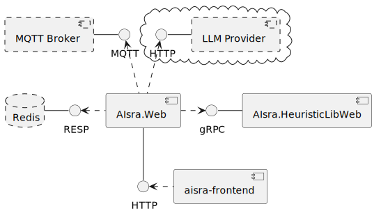
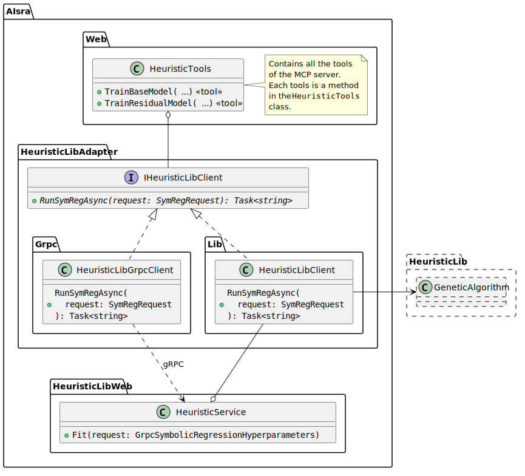

# AIsra Documentation

## Architecture

`AIsra.HeuristicLibWeb` is a wrapper around HeuristicLib that provides a gRPC interface for training SR models.
`AIsra.Web` is the main component of the application.
It provides a REST API for the frontend, collects data from the MQTT broker, stores data in the Redis database,
and communicates with HeuristicLibWeb and the LLM provider.
It also gives the LLM access to Redis and HeuristicLibWeb via an internal MCP server and client.

The backend is structured as a solution with seven projects:

* `AIsra.Common`: DTOs, enums and utility classes used by all other projects.
* `AIsra.HeuristicLibAdapter`: Contains the `IHeuristicLibClient` interface.
* `AIsra.HeuristicLibAdapter.Grpc`: Implements `IHeuristicLibClient` by making gRPC calls to HeuristicLibWeb.
* `AIsra.HeuristicLibAdapter.Lib`: Implements `IHeuristicLibClient` by making direct method calls to HeuristicLib.
* `AIsra.HeuristicLibWeb.Grpc`: Contains the gRPC service definition and mapping methods for mapping between gRPC messages and DTOs.
* `AIsra.HeuristicLibWeb.Server`: Implements the gRPC service and uses `AIsra.HeuristicLibAdapter.Lib` to forward the calls to HeuristicLib.
* `AIsra.Web`: The main component of the application.

## General Workflow

Initially, the database of SR models is empty.
Neither a base model nor a residual model has been trained yet.
After collecting data from the data stream in the database for a period of time,
the user can choose to ask the agent to train a base model.
This training is performed based on predefined hyperparameters.
Once the base model has been trained, it is stored in the database and the agent can set it as the active model to use for predictions.

## Components

The following components have been implemented to realize the workflow described above.

### `AIsra.Web`

#### Overview

`AIsra.Web` is a central component of the application. It has the following responsibilities:

* Provide a REST API to serve the frontend. This API gives the frontend access to the data stream, the available models, metrics like model quality and feature importance, and allows the user to send queries to the LLM. Streaming data like the data stream and real-time metrics are served via Server-Sent Events (SSE) over HTTP/2.
* Request completions from the LLM provider and forward them to the frontend.
* Provide an MCP server to give the LLM access to Redis, HeuristicLibWeb, and other systems. This MCP server and the associated MCP client are both running within `AIsra.Web`. They are not separate processes.

#### Endpoints

The endpoints provided by `AIsra.Web` are listed in the table below. These endpoints are used by the frontend to visualize the data stream, model metrics, and other information to the user, as well as to chat with the AI agent.

| Endpoint         | Method | SSE  | Description                                                                                   |
|------------------|--------|------|-----------------------------------------------------------------------------------------------|
| `token-stream`   | `GET`  | Yes  | Text fragments from the LLM and other related events (tool calls and concept drift detection) |
| `metrics-stream` | `GET`  | Yes  | Quality and feature importance metrics from all relevant models                               |
| `current-model`  | `GET`  | Yes  | Returns the model currently used for predictions ("active model").                            |
| `data-stream`    | `GET`  | Yes  | Forwards the data from the MQTT broker.                                                       |
| `models`         | `GET`  | No   | Returns a list of all available models.                                                       |
| `chat`           | `POST` | No   | Sends the message specified in the request body to the AI agent.                              |

#### MCP Server and Client

MCP supports stdio, Streamable HTTP, and custom transports. In this project, it has been decided to run both the MCP server and the MCP client within `AIsra.Web` and use `Pipe`s for communication between them. Having the MCP server and the web server serving the frontend in the same project allows the MCP server to perform actions that would otherwise require additional architectural considerations. For example, the MCP server would not be able to directly trigger a server-sent event to inform the frontend about a tool call if the MCP server was a separate process.

The tools provided by the MCP server are listed in the table below.

| Tool                           | Description                                                                                                                 |
|--------------------------------|-----------------------------------------------------------------------------------------------------------------------------|
| `train_base_model`             | Trains a new base model with the specified data. The data to use is determined by a timestamp that acts as the lower bound. |
| `train_residual_model`         | Trains a new residual model with the specified data, population size, and maximum iteration count.                          |
| `get_model_quality_over_time`  | Calculates the model quality over time with a sliding window. The window size and start time can be specified.              |
| `get_base_model`               | Gets the previously trained base model as a string.                                                                         |
| `get_residual_model`           | Gets the residual model with the specified ID as a string.                                                                  |
| `get_combined_model`           | Gets the combined model ($baseModel + residualModel$) with the specified ID as a string.                                    |
| `get_all_saved_models`         | Gets a list of all residual models as an array of strings.                                                                  |
| `set_active_model`             | Sets the model with the specified ID as the model used for predictions ("active model").                                    |
| `set_show_feature_importances` | Enables or disables showing the permutation feature importance of every feature in the user's chart.                        |

### HeuristicLib Adapter

`AIsra.Web` is able to communicate with HeuristicLibWeb via gRPC.
However, when `AIsra.Web` and `AIsra.HeuristicLibWeb` run in the same environment, this creates unnecessary overhead, as direct method calls would be faster than gRPC calls.
To solve this, `AIsra.HeuristicLibAdapter` provides a generic interface with two implementations:

1. `AIsra.HeuristicLibAdapter.Grpc` implements the interface by making gRPC calls to HeuristicLibWeb.
2. `AIsra.HeuristicLibAdapter.Lib` implements the interface by making direct method calls to HeuristicLib.

`AIsra.HeuristicLibWeb`, which represents the gRPC server, uses the `Lib` implementation of the adapter to forward the calls it receives from the `HeuristicLibGrpcClient` via gRPC. The diagram below shows a class diagram of this pattern.
The following figure shows a class diagram of this pattern.

### User Interface

The user interface has the following features and UI components:

* A chat window that allows the user to chat with the AI agent and shows the responses from the LLM as well as tool calls and concept drift detection events.
* Charts visualizing the data stream, the model quality over time, and the feature importance of every feature. The feature importance chart can be toggled by the agent via the `set_show_feature_importances` tool. The chart showing the quality of the active model is always visible.
* A menu that allows the user to see a list of models and add quality charts for any of the models to the dashboard.
