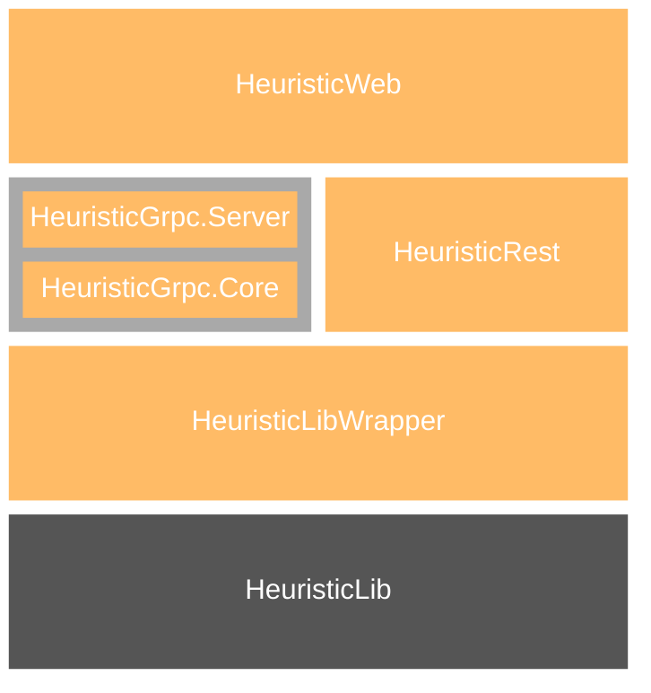
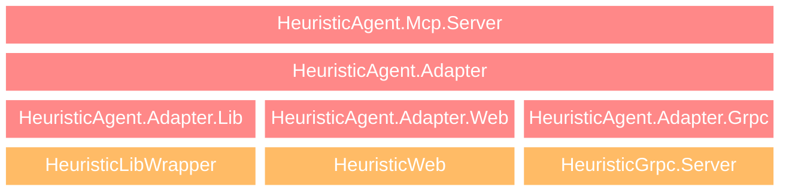

# Architecture Overview

  
<strong>Legend</strong>

   Not started yet 
   Currently in development 
   Finished 
   External dependency 

## Web

```mermaid
---
config:
  theme: 'base'
  themeVariables:
    primaryColor: '#f88'
    tertiaryColor: '#555'
    tertiaryTextColor: '#fff'
---
block columns 2
  web["HeuristicWeb"]:2

  block columns 1
    grpcServer["HeuristicGrpc.Server"]
    grpc["HeuristicGrpc.Core"]
  end
  rest["HeuristicRest"]

  hlibwrap["HeuristicLibWrapper"]:2

  hlib["HeuristicLib"]:2


  classDef default stroke-width:0;
  classDef ext fill:#555;
  classDef indev fill:#fb6;
  classDef finished fill:#6d6;

  class hlib ext
  class web,grpcServer,grpc,rest,hlibwrap indev
```

## MCP Server

```mermaid
---
config:
  theme: 'base'
  themeVariables:
    primaryColor: '#f88'
    tertiaryColor: '#555'
    tertiaryTextColor: '#fff'
---
block columns 3
  agent["HeuristicAgent.Mcp.Server"]:3

  adapter["HeuristicAgent.Adapter"]:3

  hlibwrapAdapter["HeuristicAgent.Adapter.Lib"]
  webAdapter["HeuristicAgent.Adapter.Web"]
  grpcAdapter["HeuristicAgent.Adapter.Grpc"]

  hlibwrap["HeuristicLibWrapper"]
  web["HeuristicWeb"]
  grpcServer["HeuristicGrpc.Server"]


  classDef default stroke-width:0;
  classDef ext fill:#555;
  classDef indev fill:#fb6;
  classDef finished fill:#6d6;

  class hlib ext
  class hlibwrap,web,grpcServer indev
```
